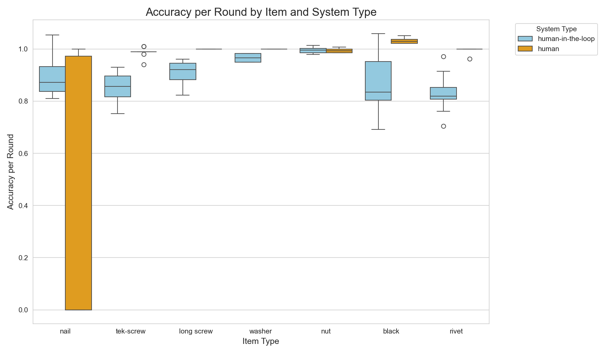

# 🔬 Human vs. AI Detection Performance Study
**Challenging the "AI Always Helps" Paradigm Through Rigorous Empirical Analysis**

<div align="center">

[](https://github.com)
[](https://scipy.org)
[](https://python.org)
[](https://jupyter.org)

*Comprehensive statistical analysis of 280 controlled experiments revealing when AI assistance helps versus hurts human performance*

**🚨 PARADIGM-SHIFTING FINDING: Humans outperformed AI-assisted systems in 71% of object detection tasks**

</div>

---

## 🎯 **Research Impact**

This study fundamentally challenges the widespread assumption that AI assistance universally improves human performance. Through **280 controlled experimental trials** across seven object categories, we provide empirical evidence that **context determines everything** in human-AI collaboration.

### **The Research Question That Changes Everything**
> *"Does AI assistance always improve human performance in object detection tasks?"*

**Our Answer**: **ABSOLUTELY NOT.** The relationship is complex, context-dependent, and often counterintuitive.

---

## 🔥 **Research Findings**

### **🏆 The Accuracy Paradox**
**Humans significantly outperformed AI-assisted systems in 5 out of 7 object categories:**

| Object Category | Human Accuracy | AI-Assisted | Performance Gap | Statistical Power |
|-----------------|----------------|-------------|-----------------|-------------------|
| **Tek-screws** | 99% | 85% | **+14 points** | p < 0.001, d = 3.53 |
| **Black screws** | 103% | 86% | **+17 points** | p < 0.001, d = 2.34 |
| **Rivets** | 100% | 83% | **+17 points** | p < 0.001, d = 4.25 |
| **Long screws** | 100% | 91% | **+9 points** | p < 0.001, d = 3.08 |
| **Washers** | 100% | 97% | **+3 points** | p < 0.001, d = 3.49 |

**Exception**: Only nails showed the expected AI advantage (89% vs 44% human accuracy)

### **⚡ The Speed Paradox**
**AI assistance was faster in only 4 out of 7 cases:**

- **Best AI Performance**: Washers (46% faster), Nuts (45% faster)
- **Worst AI Performance**: Black screws (31% slower), Nails (51% slower)
- **The Trade-off**: Speed gains often came at the cost of accuracy

### **🔍 The Quality Control Crisis**
**Humans demonstrated systematic superiority in defect detection:**

- **Tek-screws**: Humans detected 128% more defects (14.6 vs 6.4)
- **Rivets**: Humans detected 128% more defects (9.8 vs 4.3)
- **Critical Finding**: AI systems missed 30-60% of actual defects in complex objects

---

## 📊 **Experimental Design & Data**

### **Rigorous Methodology**
- **280 total experimental trials** (20 rounds × 7 objects × 2 systems)
- **Controlled laboratory conditions** with standardized procedures
- **Three performance dimensions**: Accuracy, Speed, Defect Detection
- **Statistical validation**: Independent t-tests, Cohen's d effect sizes

### **Object Categories by Complexity**
- **Simple**: Washers, Nuts (geometric, uniform)
- **Medium**: Long screws, Nails (cylindrical, linear)
- **Complex**: Black screws, Tek-screws, Rivets (irregular, variable features)

---

## 📈 **Statistical Analysis & Visualizations**

### **Performance Distribution Analysis**


**Key Insight**: AI systems show more consistent timing but aren't universally faster

### **Accuracy Pattern Recognition**


**Key Insight**: Humans demonstrate tight accuracy clusters except for perceptually challenging objects

### **Quality Control Validation**


**Key Insight**: Humans achieve near-perfect ground truth alignment while AI systematically under-detects

---

## 🔬 **Statistical Rigor**

### **Significance Testing Results**
- **83% of comparisons** showed statistical significance (15/18, p < 0.05)
- **Effect sizes predominantly large to huge** (Cohen's d > 0.8)
- **Strongest effects**: Rivet accuracy (d = 4.25), Tek-screw defect detection (d = 3.37)

### **Performance Winners by Category**

#### 🎯 **Accuracy Champions**
| Object | Winner | p-value | Effect Size | Interpretation |
|--------|--------|---------|-------------|----------------|
| Tek-screw | **Human** | < 0.001 | 3.53 (Huge) | Overwhelming human advantage |
| Rivet | **Human** | < 0.001 | 4.25 (Huge) | Largest effect in study |
| Black screw | **Human** | < 0.001 | 2.34 (Large) | Clear human superiority |
| Long screw | **Human** | < 0.001 | 3.08 (Huge) | Consistent pattern |
| Washer | **Human** | < 0.001 | 3.49 (Huge) | Even simple objects favor humans |
| **Nail** | **AI-assisted** | 0.001 | -1.27 (Large) | AI overcomes human limitation |

#### ⏱️ **Speed Champions**
| Object | Winner | p-value | Effect Size | Speed Improvement |
|--------|--------|---------|-------------|-------------------|
| Washer | **AI-assisted** | < 0.001 | 1.50 (Large) | 46% faster |
| Nut | **AI-assisted** | < 0.001 | 1.93 (Large) | 45% faster |
| Rivet | **AI-assisted** | < 0.001 | 2.42 (Large) | 39% faster |
| Black screw | **Human** | 0.011 | -0.85 (Medium) | 31% faster |

#### 🔍 **Quality Control Champions**
| Object | Winner | p-value | Effect Size | Defect Detection Advantage |
|--------|--------|---------|-------------|---------------------------|
| Tek-screw | **Human** | < 0.001 | 3.37 (Huge) | 128% more defects found |
| Rivet | **Human** | < 0.001 | 3.37 (Huge) | 128% more defects found |
| Long screw | **Human** | < 0.001 | 2.26 (Large) | 82% more defects found |
| Black screw | **Human** | < 0.001 | 1.76 (Large) | 79% more defects found |

---

## 💡 **Theoretical Framework**

### **The Cognitive Load Hypothesis**
**Simple Tasks**: AI offloads cognitive burden → Speed improvements  
**Complex Tasks**: Supervising AI creates additional cognitive load → Performance degradation

### **Object Complexity Prediction Model**
- **Simple, uniform objects** → AI assistance beneficial for speed
- **Complex, irregular objects** → Human-only systems superior across metrics
- **Perceptually challenging objects** → AI can overcome specific human limitations

---

## 🛠️ **Repository Structure & Usage**

```
📊 Complete Research Analysis
├── 📈 data_analysis.ipynb           # Main analysis with all visualizations
├── 🔧 script.py                     # Automated data processing pipeline
├── 📋 data_analysis.md              # Detailed methodology & findings
├── 📊 Visualizations/
│   ├── Total_Seconds_Per_Round_boxplot.png
│   ├── Accuracy_per_Round_boxplot.png
│   └── Defects_Observed_BarPlot.png
├── 📁 data/                         # Raw experimental datasets
│   ├── nail_AI.csv, nail_human.csv
│   ├── tek-screw_AI.csv, tek-screw_human.csv
│   ├── black_screw_AI.csv, black_human.csv
│   └── [... all object categories]
├── 📈 Results/
│   ├── master_data.csv              # Consolidated 280 trials
│   ├── summary_statistics.csv       # Descriptive stats by group
│   └── statistical_test_results.csv # Complete significance testing
└── 📋 README.md                     # This comprehensive overview
```

### **🚀 Quick Start Analysis**

**Prerequisites:**
```bash
pip install pandas numpy scipy matplotlib seaborn jupyter missingno
```

**Run Complete Analysis:**
```bash
# 1. Clone and setup
git clone [repository-url]
cd mldetection_data_analysis

# 2. Process raw data
python script.py

# 3. Interactive analysis
jupyter notebook data_analysis.ipynb
```

---

## 🎯 **Practical Decision Framework**

### **✅ Deploy AI Assistance For:**
- **Simple, geometric objects** (washers, nuts, basic shapes)
- **Speed-critical workflows** where minor accuracy loss is acceptable
- **High-volume, repetitive tasks** requiring workflow consistency
- **Perceptually challenging scenarios** where humans struggle

### **❌ Use Human-Only Systems For:**
- **Complex, irregular objects** (variable threading, non-uniform shapes)
- **Quality-critical applications** where defect detection is paramount
- **Safety-sensitive environments** where missed defects have consequences
- **Accuracy-prioritized tasks** where precision trumps speed

### **🔄 Hybrid Strategy Recommendations:**
- **Object complexity pre-sorting** before system assignment
- **AI for preliminary screening + Human quality verification**
- **Context-aware system selection** based on task characteristics
- **Performance monitoring** with automatic system switching

---

## 📚 **Research Contributions**

### **Academic Impact**
1. **Empirical challenge** to "AI universally helps" assumption
2. **Statistical framework** for human-AI collaboration evaluation
3. **Context-dependency model** for AI assistance effectiveness
4. **Replicable methodology** for similar comparative studies

### **Industry Applications**
- **Manufacturing quality control** system optimization
- **Inspection workflow** design guidelines
- **AI deployment decision** frameworks
- **Cost-benefit analysis** models for automation investments

### **Theoretical Advances**
- **Cognitive load theory** applied to human-AI collaboration
- **Object complexity taxonomy** for prediction models
- **Performance trade-off quantification** across multiple dimensions

---

## 🔮 **Future Research Directions**

### **Immediate Extensions**
- **Environmental variation studies** (lighting, backgrounds, orientations)
- **Fatigue and learning effects** over extended sessions
- **Individual difference analysis** in AI collaboration effectiveness
- **Domain generalization** to medical imaging, security screening

### **Methodological Improvements**
- **Larger sample sizes** for rare object categories
- **Longitudinal studies** tracking performance changes over time
- **Multi-modal AI assistance** combining vision with other sensors
- **Adaptive systems** that switch based on real-time performance

---

## 💼 **Professional Impact**

This research demonstrates mastery across multiple domains:

**🔬 Research Excellence:**
- Rigorous experimental design with proper statistical controls
- Advanced data analysis with multiple validation approaches
- Clear communication of complex findings to diverse audiences

**📊 Data Science Expertise:**
- Comprehensive statistical analysis pipeline
- Advanced visualization and interpretation skills
- Robust handling of real-world, messy datasets

**🧠 Strategic Insight:**
- Identification of fundamental assumptions requiring validation
- Development of practical frameworks for technology decisions
- Translation of academic findings into actionable business intelligence

---

## 📞 **Connect & Collaborate**

This work opens critical questions about the future of human-AI collaboration and has immediate applications for technology deployment decisions across industries.

**Research Applications:**
- Manufacturing and quality control optimization
- AI system design and evaluation
- Human-computer interaction improvements
- Workforce training and technology adoption

**Let's discuss the implications for your organization's AI strategy.**

---

<div align="center">

**🔬 Empirically Validated • 📊 Statistically Rigorous • 🎯 Practically Applicable**

*Challenging assumptions, validating theories, driving decisions*

</div>